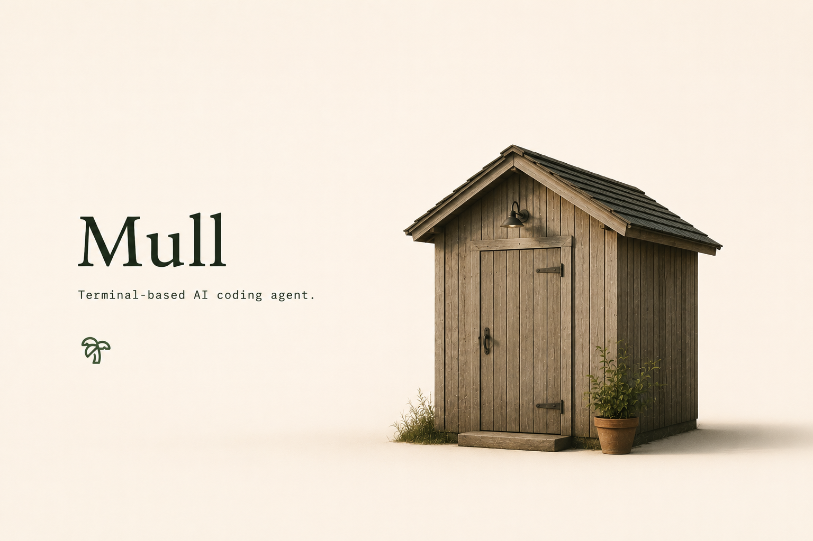

<div align="center">



# Mull (`mull`)

Terminal-based AI coding agent.

<p>
  
</p>

[Build](#building-from-source) ·
[Documentation](#documentation) ·
[Development](#development) ·
[License](#license)

</div>

---

## Building from source

### Requirements

- Rust
- DotSlash
- `protoc`

```sh
cargo install dotslash

cargo run -p mull-pager-bin
```

Release build:

```sh
cargo build -p mull-pager-bin --release
```

## Documentation

See the user guide:

- [`crates/codegen/mull-pager/docs/user-guide/`](crates/codegen/mull-pager/docs/user-guide/)

## Development

```sh
cargo check -p <crate>
cargo test -p <crate>
cargo clippy -p <crate>
cargo fmt --all
```

## License

Licensed under the Apache License 2.0.

See [LICENSE](LICENSE).